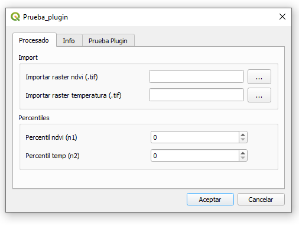

# QGIS-Plugins

## Descripción
Repositorio con plugins desarrollados para realizar procesamientos en QGIS.

## Plugins
1. Plugin de prueba: Selección de pixeles fríos (en proceso), proceso que forma parte del Modelo Metric para estimar la evapotranspiración actual de zonas de cultivo.

   

## Referencias
1. Curso "Experto en Creación de Plugins para QGIS con Python, PyQGIS y PyQT" - [Academia CAEG](https://academia.geomatica.online/).
2. QGIS Plugin Tutorial Playlist - [Rob en Youtube](https://www.youtube.com/playlist?list=PLNGJFYgJ43Vo2P9Q8TWf7_ApmFDTiW9Ku).